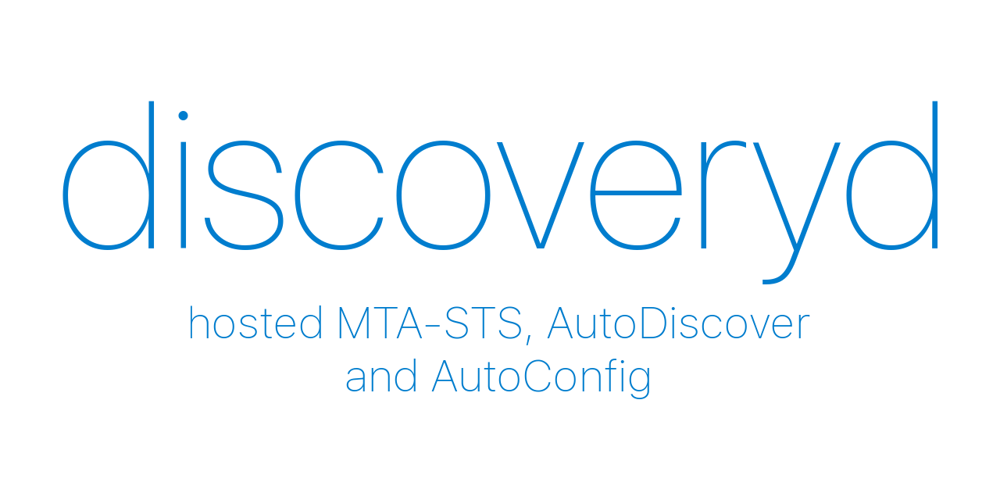

## About
discoveryd is a service that allows you to easily host MTA-STS, AutoDiscover and AutoConfig for multiple domains.
This service is hosted for free at [freediscover.toast.ws](https://freediscover.toast.ws), which you can use by contacting me via E-Mail.

This project was started since most guides on the internet recommend that you set up some dodgy PHP script.
Not everyone wants to deploy a full web server with PHP, which is why I wanted to make it easier for people who host their own mail server.

## Deployment
You can either build the service yourself or use the pre-built binary that is attached to the latest release.
It is also possible to deploy the docker container, which you can build with the Dockerfile in this repository.

Either way, you'll need a database, which you can use by setting the `ROCKET_DATABASES` environment variable. To see an example of this, you can take a look at the [docker-compose.yml](/docker-compose.yml) file that is used for local development.
